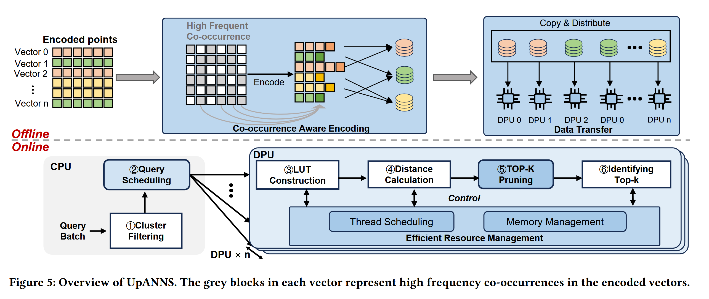

how to use AI agent 
- to draw a picture or a diagram for presentation 
- to prepare slides more efficiently than PowerPoint or Canva 

our tools include 
draw.io
Mermaid 
html writer 

 

create a image.html to replicate the image above 
also create an image.drawio to replicate the image above 
we need a more generic version with the texts being replaced with placeholder 

got some insights from a student 
slide generation involves three parts
- text prep
- image selection or generation 
- 