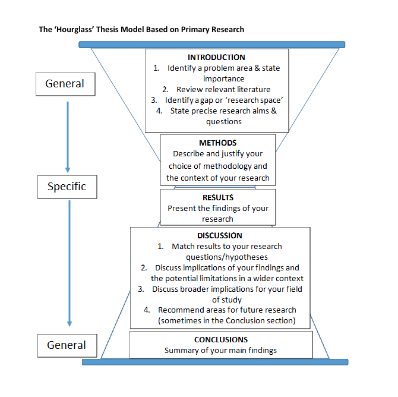
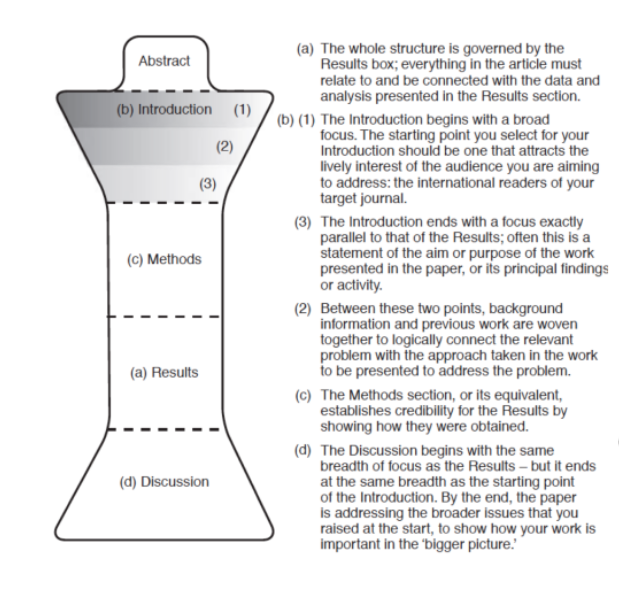
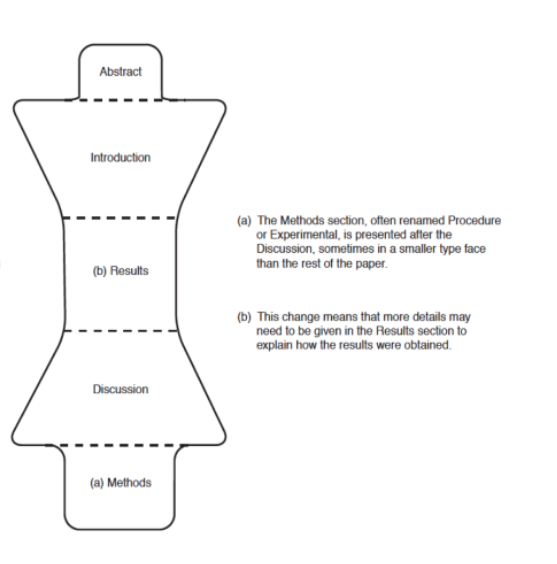
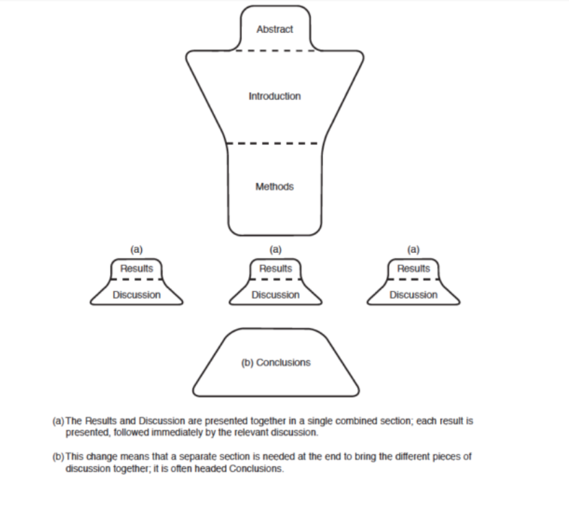

# Theme 2: Document Structures

## Structure of a Thesis/Journal Article

A thesis/journal article is a record of research work which usually involves five major stages:

1. identifying a research area
2. setting research questions which have not yet been sufficiently addressed by previous research
3. designing a study that will seek to provide answers to the research questions and carrying it out
4. collecting data, collating, analyzing and interpreting results
5. drawing conclusions or generalizations from your findings

The structure of a thesis and a journal article usually follows the sequence of these five stages:

- Introduction
- Literature Review
- Methods
- Results
- Discussion
- Conclusion

---

flowchart LR
    A[Introduction] --> B[Literature Review]
    B --> C[Methods]
    C --> D[Results]
    D --> E[Discussion]
    E --> F[Conclusion]

Flowchart: Introduction → Literature Review → Methods → Results → Discussion → Conclusion

we can come up with an html to show this diagram or other machine readable format but this is not a priority

### The 'Hourglass' Thesis Model Based on Primary Research

#### General

#### Specific

#### General

**INTRODUCTION**

1. Identify a problem area & state importance
2. Review relevant literature
3. Identify a gap or 'research space'
4. State precise research aims & questions

**METHODS**

- Describe and justify your choice of methodology and the context of your research

**RESULTS**

- Present the findings of your research

**DISCUSSION**

1. Match results to your research questions/hypotheses
2. Discuss implications of your findings and the potential limitations in a wider context
3. Discuss broader implications for your field of study
4. Recommend areas for future research (sometimes in the Conclusion section)

**CONCLUSIONS**

- Summary of your main findings

---

### Other Possible Journal Article Structures

---

### Students' Theses on HKBU Library Website

[https://scholars.hkbu.edu.hk/en/studentTheses/](https://scholars.hkbu.edu.hk/en/studentTheses/)

Take a look at the former HKBU MPhil and PhD students' theses to learn about the structure, language features and styles of theses in your discipline.

---

## Activities & Tasks

### Warm-up Task

What do you know about the structure of a typical thesis and journal article in your discipline?

1. Work with a classmate who is also from your discipline, if possible. List the key sections of a typical journal article and key chapters of a thesis in your discipline.
2. Do you think the thesis and journal article structure are the same for all disciplines? What might be the variations across disciplines? Why?

---

### Task 1

The structure of a thesis/journal article can vary, depending on the nature of your research. Get into groups of 4 and do the following:

1. Have you seen any other thesis/journal article structures in addition to the IMRD format?
2. Tell your group members the typical thesis/journal article structure in your discipline. Why do you think this structure is particularly common in your discipline?

---
